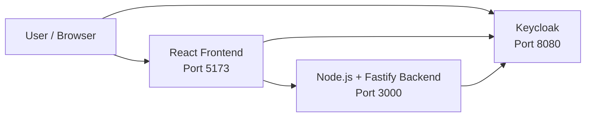
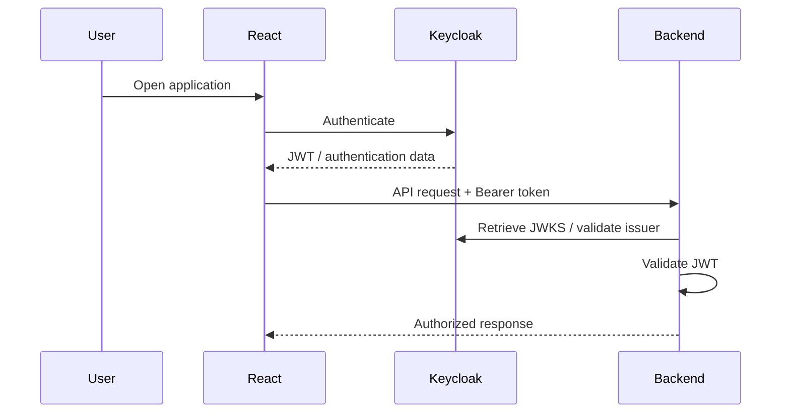

# GIS React + Keycloak

A full-stack **Web GIS application** built with **React, TypeScript, OpenLayers, Node.js, Fastify, Docker and Keycloak**.

The application combines an interactive map viewer with user and role management through Keycloak. It provides a map interface where users can navigate through Spanish municipalities, switch between different basemaps, and visualize cadastral information provided through a WMS service.

The project is divided into a React frontend and a Node.js/Fastify backend, with Keycloak providing authentication and authorization.

**Repository:** https://github.com/enri123/ProyectoGISReactsKeycloak

---

## 📑 Table of Contents

* [Features](#features)
* [Technologies](#technologies)
* [Architecture](#architecture)
* [Project Structure](#project-structure)
* [Prerequisites](#prerequisites)
* [Installation](#installation)
* [Environment Variables](#environment-variables)
* [Keycloak Configuration](#keycloak-configuration)
* [Running the Application](#running-the-application)

  * [Docker Compose](#docker-compose)
  * [Local Development](#local-development)
* [Usage](#usage)
* [Authentication and Authorization](#authentication-and-authorization)
* [GIS Functionality](#gis-functionality)
* [Backend API](#backend-api)
* [Frontend](#frontend)
* [Development](#development)
* [Continuous Integration](#continuous-integration)
* [Troubleshooting](#troubleshooting)
* [Author](#author)

---

# Features

* 🗺️ Interactive Web GIS viewer.
* 📍 Navigation through Spanish municipalities.
* 🔎 Automatic map navigation/zoom to selected municipalities.
* 🗺️ Multiple basemaps.
* 🌍 OpenStreetMap basemap.
* 🛰️ Google Satellite basemap.
* 🏠 Spanish cadastral information through a WMS service.
* 🔐 Authentication with Keycloak.
* 👤 User management.
* 🛡️ Role management.
* 👥 Keycloak groups.
* 🔑 JWT-based authentication.
* 🔏 Backend JWT validation using Keycloak JWKS.
* 🐳 Docker and Docker Compose support.
* 🔄 Development environment with separate frontend, backend and Keycloak services.
* ⚙️ Automated frontend and backend validation through GitHub Actions.

---

# Technologies

## Frontend

| Technology   | Purpose                           |
| ------------ | --------------------------------- |
| React        | User interface                    |
| TypeScript   | Static typing                     |
| Vite         | Development server and build tool |
| OpenLayers   | Interactive GIS maps              |
| Keycloak JS  | Authentication                    |
| React Router | Frontend routing                  |
| Material UI  | UI components                     |
| Bootstrap    | UI/styling utilities              |

## Backend

| Technology      | Purpose                         |
| --------------- | ------------------------------- |
| Node.js         | JavaScript runtime              |
| TypeScript      | Static typing                   |
| Fastify         | REST API framework              |
| `@fastify/cors` | CORS configuration              |
| `@fastify/jwt`  | JWT handling                    |
| `jwks-rsa`      | Keycloak JWKS integration       |
| `dotenv`        | Environment-variable management |

## Infrastructure

| Technology     | Purpose                        |
| -------------- | ------------------------------ |
| Docker         | Containerization               |
| Docker Compose | Multi-container orchestration  |
| Keycloak       | Identity and access management |
| GitHub Actions | Continuous integration         |

## GIS

| Technology | Purpose                       |
| ---------- | ----------------------------- |
| OpenLayers | Map rendering and interaction |
| WMS        | Cadastral data visualization  |

---

# Architecture

The application consists of three main services:

1. **Frontend** — React application served through the frontend container.
2. **Backend** — Node.js/Fastify REST API.
3. **Keycloak** — Authentication and authorization server.

All three services communicate through the Docker `app-network` network.



### Docker network communication

One of the most important details of this architecture is the difference between URLs used by the browser and URLs used between Docker containers.

```text
Browser → Frontend: http://localhost:5173
Browser → Backend:  http://localhost:3000
Browser → Keycloak: http://localhost:8080

Backend → Keycloak: http://keycloak:8080
```

Inside the backend container, `localhost` refers to the backend container itself. Therefore, the backend must use the Docker service name `keycloak` to communicate with Keycloak.

---

# Project Structure

The repository is organized approximately as follows:

ProyectoGISReactsKeycloak/
│
├── .github/
│   └── workflows/
│       └── validate.yml
│
├── Backend/
│   ├── plugins/
│   │   └── auth.ts
│   ├── Router/
│   │   └── user.ts
│   ├── services/
│   │   └── keycloakService.ts
│   ├── types/
│   │   └── fastify.d.ts
│   ├── .dockerignore
│   ├── .env
│   ├── .prettierignore
│   ├── .prettierrc
│   ├── Dockerfile
│   ├── package.json
│   ├── package-lock.json
│   ├── server.ts
│   └── tsconfig.json
│
├── Frontend/
│   ├── public/
│   ├── src/
│   │   ├── assets/
│   │   ├── auth/
│   │   │   ├── AuthProvider.tsx
│   │   │   ├── keycloak.tsx
│   │   │   └── useAuth.tsx
│   │   ├── layout/
│   │   │   ├── LayoutContext.tsx
│   │   │   ├── PortalLayout.tsx
│   │   │   ├── SideBarLayout.tsx
│   │   │   └── useLayoutContext.tsx
│   │   ├── routes/
│   │   │   ├── CapasMap.tsx
│   │   │   ├── CrearUsuarios.tsx
│   │   │   ├── Dashboard.tsx
│   │   │   ├── DashboardMap.tsx
│   │   │   └── GeoJsonMap.tsx
│   │   ├── App.css
│   │   ├── App.tsx
│   │   ├── const.tsx
│   │   ├── index.css
│   │   └── main.tsx
│   ├── .dockerignore
│   ├── .prettierignore
│   ├── .prettierrc
│   ├── Dockerfile
│   ├── eslint.config.js
│   ├── index.html
│   ├── package.json
│   ├── package-lock.json
│   ├── tsconfig.app.json
│   ├── tsconfig.json
│   ├── tsconfig.node.json
│   └── vite.config.ts
│
├── .gitattributes
├── .gitignore
├── docker-compose.yml
└── README.md
```

---

# Prerequisites

For the recommended Docker-based setup, you need:

* Git
* Docker
* Docker Compose

For local development without Docker, you also need:

* Node.js 20
* npm
* A running Keycloak instance

The project's GitHub Actions workflow uses **Node.js 20** for both frontend and backend validation.

---

# Installation

Clone the repository:

```bash
git clone https://github.com/enri123/ProyectoGISReactsKeycloak.git
```

Enter the project directory:

```bash
cd ProyectoGISReactsKeycloak
```

The recommended way to run the complete application is Docker Compose.

---

# Environment Variables

The backend uses environment variables for its Keycloak configuration.

The main deployment-specific setting is:

```env
DESPLIEGUE
```

When the application is executed through Docker, use the Docker configuration:

```env
DESPLIEGUE=docker
```

When running the backend directly on the host machine, use:

```env
DESPLIEGUE=local
```

The application uses different Keycloak URLs depending on this value.

## Keycloak administration credentials

The Docker Compose configuration initializes Keycloak with:

```env
KEYCLOAK_ADMIN=admin
KEYCLOAK_ADMIN_PASSWORD=admin
```

These credentials are intended for the development environment.

## Backend `.env`

The backend `.env` file also contains the Keycloak service-account client secret:

```env
KEYCLOAK_ADMIN_CLIENT_SECRET=<your-client-secret>
```

The value must be obtained from the `backend-admin` Keycloak client described below.

---

# Keycloak Configuration

Keycloak is required for the project's complete authentication, authorization and user-management functionality.

Without configuring Keycloak, the application can be started, but authentication-dependent functionality will not work correctly.

## 1. Start the application

From the project root:

```bash
docker compose up
```

Once the containers are running, access the Keycloak administration console:

```text
http://localhost:8080
```

Log in using:

```text
Username: admin
Password: admin
```

---

## 2. Create the realm

Open:

```text
Manage realms
```

Create a new realm with:

```text
Realm name: reino-infodp
```

The application uses this realm for its authentication configuration.

---

## 3. Create the frontend client

Go to:

```text
Clients
```

Create a new client:

```text
Client ID: react-app-client
```

Configure the client with the following URLs:

```text
Root URL:
http://localhost:5173

Home URL:
http://localhost:5173

Web origins:
http://localhost:5173

Valid redirect URIs:
http://localhost:5173/*
```

This client is used by the React application to authenticate users through Keycloak.

---

## 4. Create a user

Go to:

```text
Users
```

Create a user.

For example:

```text
Username: enri
Email: enri@gmail.com
First name: Enri
Last name: Ruiz
```

The specific user information is not important for the configuration.

---

## 5. Configure the user password

Open the newly created user and go to:

```text
Credentials
```

Set a password.

For example:

```text
Password: root
```

Make sure:

```text
Temporary: Off
```

Otherwise, Keycloak will require the user to change the password on the first login.

---

## 6. Create realm roles

Go to:

```text
Realm roles
```

Create the following roles:

```text
user_creation
Ayuntamiento
tecnico_gis
user
```

The roles can subsequently be used to control the functionality available to users.

---

## 7. Create groups

Go to:

```text
Groups
```

Create:

```text
Admin
User
```

### Admin group

Open the `Admin` group and navigate to:

```text
Role Mapping
```

Select:

```text
Assign role
```

Then:

```text
Realm roles
```

Assign the previously created roles.

Finally, go to:

```text
Members
```

Select:

```text
Add member
```

and add the previously created user.

This associates the user with the group and its role mappings.

---

# Backend Administration Client

The backend requires a Keycloak service account with enough permissions to perform user-management operations.

## 8. Create `backend-admin`

Go to:

```text
Clients
```

Create a new client:

```text
Client ID: backend-admin
```

Configure the client as follows:

```text
Client authentication: ON
Service account roles: ON
Standard flow: OFF
```

The root and home URLs can be configured as:

```text
Root URL:
http://localhost:5173

Home URL:
http://localhost:5173
```

---

## 9. Assign service-account roles

Open:

```text
backend-admin
```

Navigate to:

```text
Service Account Roles
```

Select:

```text
Assign role
```

Then:

```text
Client roles
```

Assign:

```text
manage-users
view-realm
view-users
```

These permissions allow the backend service account to perform the required Keycloak administration operations.

---

## 10. Configure the client secret

Open:

```text
backend-admin → Credentials
```

Copy the generated:

```text
Client secret
```

Add it to:

```text
Backend/.env
```

using:

```env
KEYCLOAK_ADMIN_CLIENT_SECRET=<your-client-secret>
```

Once this is configured, the project's Keycloak-dependent functionality should be available.

---

# Running the Application

The Docker Compose configuration contains three services.

### Frontend

```text
Container: react-app
Port: 5173:80
```

The React application is available at:

```text
http://localhost:5173
```

### Backend

```text
Container: node-api
Port: 3000:3000
```

The backend API is available at:

```text
http://localhost:3000
```

The backend mounts the local source directory:

```yaml
volumes:
  - ./Backend:/app
  - /app/node_modules
```

This allows backend source changes to be reflected in the running development container without rebuilding the image.

### Keycloak

```text
Container: keycloak
Port: 8080:8080
```

Keycloak is available at:

```text
http://localhost:8080
```

The configured Docker image is:

```text
quay.io/keycloak/keycloak:26.7
```

Keycloak starts using:

```text
start-dev
```

---

## Docker Compose configuration

The services communicate through the following Docker network:

```text
app-network
```

The network uses the Docker bridge driver.

The dependency relationship is:

```text
Frontend
 ├── Keycloak
 └── Backend
       └── Keycloak
```

---

## Stop the application

If running in the foreground, press:

```text
Ctrl+C
```

For detached containers:

```bash
docker compose down
```

---

## Rebuild the entire project

When Dockerfiles or image-level dependencies change:

```bash
docker compose build
```

Then:

```bash
docker compose up
```

Or:

```bash
docker compose up --build
```

---

## Rebuild only the backend

If changes require rebuilding only the backend image:

```bash
docker compose build backend
```

Then restart the backend:

```bash
docker compose up -d backend
```

Alternatively:

```bash
docker compose up -d --build backend
```

Because the backend source directory is mounted as a volume, normal source-code changes generally do not require rebuilding the Docker image.

---

## Applying `.env` changes

Changes to `Backend/.env` are different from changes to source files.

After changing environment variables, recreate the backend container:

```bash
docker compose up -d --force-recreate backend
```

If the environment change is associated with image configuration or the Dockerfile, rebuild as well:

```bash
docker compose up -d --build --force-recreate backend
```

---

# Local Development

Docker is the recommended way to run the complete stack because it provides the required Keycloak, backend and frontend services together.

For local development, the backend can be executed directly with Node.js.

## Backend

```bash
cd Backend
npm install
npm run dev
```

When the backend runs directly on the host, set:

```env
DESPLIEGUE=local
```

and configure its Keycloak URL for host access.

## Frontend

In another terminal:

```bash
cd Frontend
npm install
npm run dev
```

The frontend is developed using Vite.

> **Important:** If the frontend and backend are run directly on the host while Keycloak is running in Docker, Keycloak is still accessed through `http://localhost:8080` from the browser/host.

---

# Usage

## Login

After completing the Keycloak configuration:

1. Open the frontend.
2. Start the login process.
3. Keycloak displays the authentication page.
4. Enter the credentials of the configured user.
5. Keycloak authenticates the user.
6. The frontend receives the authentication information.
7. Authenticated requests can be sent to the backend.

The application requires the appropriate Keycloak configuration for login and authenticated functionality.

---

## User and role management

The application includes user-management functionality through Keycloak.

The backend communicates with Keycloak using the `backend-admin` service account.

This allows the application to perform operations such as:

* User creation.
* User management.
* Role-related operations.
* Access to Keycloak realm/user information.

The `manage-users`, `view-realm` and `view-users` service-account roles are therefore required for the corresponding administrative functionality.

---

# Authentication and Authorization

The authentication architecture is based on **OpenID Connect and JWT**.



## JWT validation

The backend uses:

```text
@fastify/jwt
```

for JWT handling and:

```text
jwks-rsa
```

for retrieving Keycloak's public signing keys.

The backend validates the token's signature and claims, including the issuer.

---

## Issuer configuration

The Keycloak issuer must match the issuer contained in the JWT.

A mismatch can result in errors such as:

```text
Invalid token issuer
```

For Docker networking, the backend communicates with Keycloak using:

```text
http://keycloak:8080
```

For browser access:

```text
http://localhost:8080
```

These URLs have different purposes and should not be confused.

---

# GIS Functionality

The project provides a Web GIS viewer based on OpenLayers.

## Municipality navigation

The sidebar provides access to different Spanish municipalities.

Selecting a municipality automatically moves the map to its corresponding location.

This provides a simple way to navigate through the available municipalities without manually searching or moving the map.

---

## Basemaps

The application provides different map backgrounds, including:

### OpenStreetMap

An OpenStreetMap-based map can be selected from the sidebar.

### Google Satellite

A satellite imagery basemap is also available.

Users can switch between the available map types through the application's sidebar.

---

## Spanish Cadastre WMS

The application also integrates cadastral information from Spain through a **WMS service**.

The cadastral layer allows users to visualize cadastral information on top of the map.

The cadastral information is currently a visualization layer:

* It can be displayed on the map.
* It provides additional geographic information.
* It is not an interactive editing layer.

In other words, the application allows users to **visualize** the cadastral WMS data but does not provide editing/interactivity with the cadastral objects themselves.

---

# Backend API

The backend is implemented with **Fastify** and TypeScript.

The main API route group is:

```text
/api/users
```

The backend also exposes:

```text
/
```

for the root endpoint.

The backend listens on:

```text
3000
```

by default.

## Authentication

Protected endpoints require a valid JWT issued by Keycloak.

The frontend sends the token using:

```http
Authorization: Bearer <token>
```

The backend validates the token before processing the request.

---

# Frontend

The frontend is a React + TypeScript application powered by Vite.

The source code is located in:

```text
Frontend/src/
```

Relevant areas include:

```text
Frontend/src/
├── assets/
├── auth/
├── layout/
├── routes/
├── App.tsx
├── App.css
├── const.tsx
├── index.css
└── main.tsx
```

### `auth`

Contains authentication-related frontend functionality.

### `layout`

Contains the application's layout components, including the sidebar-oriented interface.

### `routes`

Contains the application's route configuration/pages.

### OpenLayers

OpenLayers provides the map engine and geographic interaction functionality.

---

# Development

## Frontend commands

From `Frontend`:

```bash
npm install
```

Start development mode:

```bash
npm run dev
```

Build the production application:

```bash
npm run build
```

Run linting:

```bash
npm run lint
```

Check formatting:

```bash
npm run format:check
```

Format the code:

```bash
npm run format
```

Run TypeScript type checking:

```bash
npm run typecheck
```

Run tests:

```bash
npm test
```

Preview the production build:

```bash
npm run preview
```

---

## Backend commands

From `Backend`:

```bash
npm install
```

Start the development server:

```bash
npm run dev
```

Run the project's validation commands:

```bash
npm run format:check
npm run lint
npm run typecheck
npm test
npm run build
```

---

# Continuous Integration

The repository includes a GitHub Actions workflow:

```text
.github/workflows/validate.yml
```

The workflow runs for:

* Pull requests targeting `main`.
* Pushes to `main`.
* Manual workflow execution through `workflow_dispatch`.

The workflow uses:

```text
Node.js 20
```

and validates both the frontend and backend independently.

## Frontend CI

The frontend pipeline performs:

```bash
npm ci
npm run format:check
npm run lint
npm run typecheck
npm test
npm run build
```

If successful, the production build is uploaded as:

```text
frontend-dist
```

---

## Backend CI

The backend pipeline performs:

```bash
npm ci
npm run format:check
npm run lint
npm run typecheck
npm test
npm run build
```

If successful, the production build is uploaded as:

```text
backend-dist
```

This ensures that pull requests and changes merged into `main` pass the project's formatting, linting, type-checking, testing and build stages.

---

# Troubleshooting

## `Invalid token issuer`

### Symptom

The backend rejects a JWT with an error similar to:

```text
Invalid token issuer
```

### Cause

The issuer configured in the backend does not match the `iss` claim contained in the Keycloak token.

This commonly occurs when `localhost` and the Docker service name are mixed.

### Solution

When the backend runs inside Docker, use:

```text
http://keycloak:8080
```

for backend-to-Keycloak communication.

The browser should continue using:

```text
http://localhost:8080
```

Do not replace the Docker service URL with `localhost` inside the backend container.

---

## Backend cannot connect to Keycloak

### Symptom

The backend cannot communicate with Keycloak.

### Cause

The backend is running inside Docker and attempts to connect using:

```text
http://localhost:8080
```

Inside a container, `localhost` refers to that container.

### Solution

Use:

```env
KEYCLOAK_URL=http://keycloak:8080
```

when the backend is running through Docker Compose.

Make sure both services are connected to:

```text
app-network
```

---

## Login does not work

### Check the following

Verify that the realm exists:

```text
reino-infodp
```

Verify that the frontend client exists:

```text
react-app-client
```

Verify:

```text
Root URL:
http://localhost:5173
```

Verify:

```text
Home URL:
http://localhost:5173
```

Verify:

```text
Web origins:
http://localhost:5173
```

Verify:

```text
Valid redirect URIs:
http://localhost:5173/*
```

Also check that the user has a valid non-temporary password.

---

## User creation does not work

### Symptom

The application cannot create users through Keycloak.

### Cause

The backend service account may not have the required Keycloak permissions.

### Solution

Open:

```text
Clients → backend-admin → Service Account Roles
```

Assign the required client roles:

```text
manage-users
view-realm
view-users
```

Also verify that:

```env
KEYCLOAK_ADMIN_CLIENT_SECRET=<your-client-secret>
```

contains the current secret from:

```text
Clients → backend-admin → Credentials
```

### Docker-specific issue

Occasionally, Keycloak or the backend may require a container restart before newly configured permissions or environment changes are recognized.

Try:

```bash
docker compose restart
```

If the issue persists:

```bash
docker compose down
docker compose up -d
```

---

## Application starts but authentication-dependent functionality does not work

The application can run without completing the complete Keycloak configuration, but functionality such as:

* Login.
* Logout.
* User creation.
* User administration.
* Role-related functionality.

will not work correctly.

Complete the Keycloak setup described in this README.

---

## Changes to backend code are not reflected

The backend container mounts:

```yaml
- ./Backend:/app
- /app/node_modules
```

Therefore, source changes are available inside the container.

If the development process is not detecting the change, restart the backend:

```bash
docker compose restart backend
```

If Docker configuration or dependencies have changed, rebuild:

```bash
docker compose up -d --build backend
```

---

## Changes to `.env` are not reflected

Environment variables are loaded when the application/container starts.

After modifying `Backend/.env`, recreate the backend container:

```bash
docker compose up -d --force-recreate backend
```

For changes that also require rebuilding:

```bash
docker compose up -d --build --force-recreate backend
```

---

# Important Configuration Notes

### `localhost` vs Docker service names

This is one of the most important concepts when running the project with Docker.

From the browser:

```text
localhost → host machine
```

From the backend container:

```text
localhost → backend container
```

Therefore:

```text
Browser → Keycloak
http://localhost:8080
```

while:

```text
Backend → Keycloak
http://keycloak:8080
```

### Deployment mode

If the application is running through Docker:

```env
DESPLIEGUE=docker
```

If the backend is being executed directly on the host:

```env
DESPLIEGUE=local
```

Using the wrong value can cause the backend to use the wrong Keycloak URL.

---

# Author

**Enri Ruiz**

GitHub: https://github.com/enri123

---