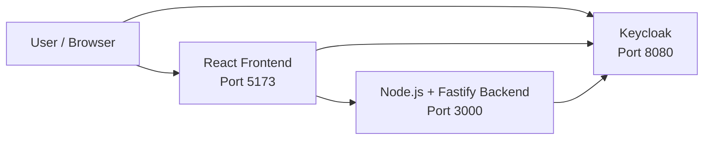
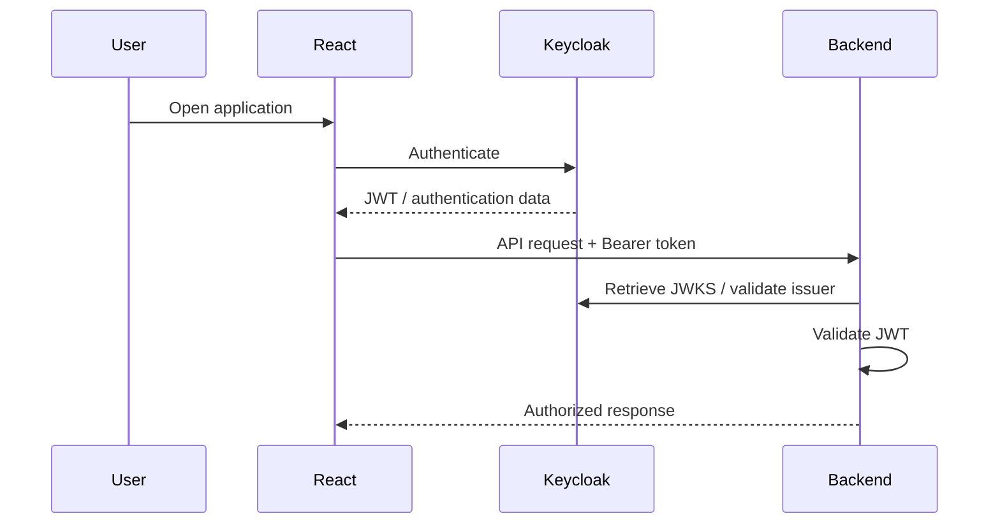
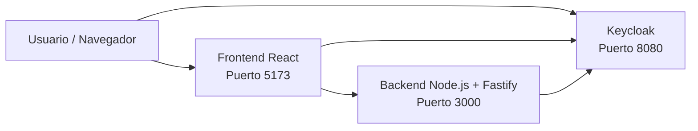
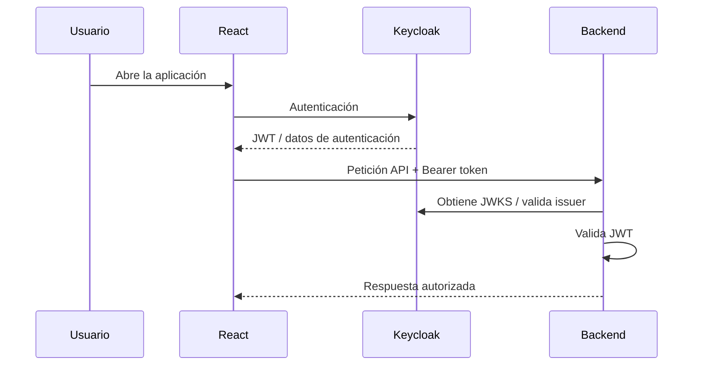

# GIS React + Keycloak

A full-stack **Web GIS application** built with **React, TypeScript, OpenLayers, Node.js, Fastify, Docker and Keycloak**.

The application combines an interactive map viewer with user and role management through Keycloak. It provides a map interface where users can navigate through Spanish municipalities, switch between different basemaps, and visualize cadastral information provided through a WMS service.

The project is divided into a React frontend and a Node.js/Fastify backend, with Keycloak providing authentication and authorization.

**Repository:** https://github.com/enri123/ProyectoGISReactsKeycloak

---

## 📑 Table of Contents

* [Features](#features)
* [Technologies](#technologies)
* [Architecture](#architecture)
* [Project Structure](#project-structure)
* [Prerequisites](#prerequisites)
* [Installation](#installation)
* [Environment Variables](#environment-variables)
* [Keycloak Configuration](#keycloak-configuration)
* [Running the Application](#running-the-application)

  * [Docker Compose](#docker-compose)
  * [Local Development](#local-development)
* [Usage](#usage)
* [Authentication and Authorization](#authentication-and-authorization)
* [GIS Functionality](#gis-functionality)
* [Backend API](#backend-api)
* [Frontend](#frontend)
* [Development](#development)
* [Continuous Integration](#continuous-integration)
* [Troubleshooting](#troubleshooting)
* [Future Improvements](#future-improvements)
* [Author](#author)
* [🇪🇸 Español](#-español)

---

# Features

* 🗺️ Interactive Web GIS viewer.
* 📍 Navigation through Spanish municipalities.
* 🔎 Automatic map navigation/zoom to selected municipalities.
* 🗺️ Multiple basemaps.
* 🌍 OpenStreetMap basemap.
* 🛰️ Google Satellite basemap.
* 🏠 Spanish cadastral information through a WMS service.
* 🔐 Authentication with Keycloak.
* 👤 User management.
* 🛡️ Role management.
* 👥 Keycloak groups.
* 🔑 JWT-based authentication.
* 🔏 Backend JWT validation using Keycloak JWKS.
* 🐳 Docker and Docker Compose support.
* 🔄 Development environment with separate frontend, backend and Keycloak services.
* ⚙️ Automated frontend and backend validation through GitHub Actions.

---

# Technologies

## Frontend

| Technology   | Purpose                           |
| ------------ | --------------------------------- |
| React        | User interface                    |
| TypeScript   | Static typing                     |
| Vite         | Development server and build tool |
| OpenLayers   | Interactive GIS maps              |
| Keycloak JS  | Authentication                    |
| React Router | Frontend routing                  |
| Material UI  | UI components                     |
| Bootstrap    | UI/styling utilities              |

## Backend

| Technology      | Purpose                         |
| --------------- | ------------------------------- |
| Node.js         | JavaScript runtime              |
| TypeScript      | Static typing                   |
| Fastify         | REST API framework              |
| `@fastify/cors` | CORS configuration              |
| `@fastify/jwt`  | JWT handling                    |
| `jwks-rsa`      | Keycloak JWKS integration       |
| `dotenv`        | Environment-variable management |

## Infrastructure

| Technology     | Purpose                        |
| -------------- | ------------------------------ |
| Docker         | Containerization               |
| Docker Compose | Multi-container orchestration  |
| Keycloak       | Identity and access management |
| GitHub Actions | Continuous integration         |

## GIS

| Technology | Purpose                       |
| ---------- | ----------------------------- |
| OpenLayers | Map rendering and interaction |
| WMS        | Cadastral data visualization  |

---

# Architecture

The application consists of three main services:

1. **Frontend** — React application served through the frontend container.
2. **Backend** — Node.js/Fastify REST API.
3. **Keycloak** — Authentication and authorization server.

All three services communicate through the Docker `app-network` network.



### Docker network communication

One of the most important details of this architecture is the difference between URLs used by the browser and URLs used between Docker containers.

```text
Browser → Frontend: http://localhost:5173
Browser → Backend:  http://localhost:3000
Browser → Keycloak: http://localhost:8080

Backend → Keycloak: http://keycloak:8080
```

Inside the backend container, `localhost` refers to the backend container itself. Therefore, the backend must use the Docker service name `keycloak` to communicate with Keycloak.

---

# Project Structure

The repository is organized approximately as follows:

ProyectoGISReactsKeycloak/
│
├── .github/
│   └── workflows/
│       └── validate.yml
│
├── Backend/
│   ├── plugins/
│   │   └── auth.ts
│   ├── Router/
│   │   └── user.ts
│   ├── services/
│   │   └── keycloakService.ts
│   ├── types/
│   │   └── fastify.d.ts
│   ├── .dockerignore
│   ├── .env
│   ├── .prettierignore
│   ├── .prettierrc
│   ├── Dockerfile
│   ├── package.json
│   ├── package-lock.json
│   ├── server.ts
│   └── tsconfig.json
│
├── Frontend/
│   ├── public/
│   ├── src/
│   │   ├── assets/
│   │   ├── auth/
│   │   |   └── AuthProvider.tsx
│   │   |   └── keycloak.tsx
│   │   |   └── useAuth.tsx
│   │   ├── layout/
│   │   |   └── LayoutContext.tsx
│   │   |   └── PortalLayout.tsx
│   │   |   └── SideBarLayout.tsx
│   │   |   └── useLayoutContext.tsx
│   │   ├── routes/
│   │   |   └── CapasMap.tsx
│   │   |   └── CrearUsuarios.tsx
│   │   |   └── Dashboard.tsx
│   │   |   └── DashboardMap.tsx
│   │   |   └── GeoJsonMap.tsx
│   │   ├── App.css
│   │   ├── App.tsx
│   │   ├── const.tsx
│   │   ├── index.css
│   │   └── main.tsx
│   ├── .dockerignore
│   ├── .prettierignore
│   ├── .prettierrc
│   ├── Dockerfile
│   ├── eslint.config.js
│   ├── index.html
│   ├── package.json
│   ├── package-lock.json
│   ├── tsconfig.app.json
│   ├── tsconfig.json
│   ├── tsconfig.node.json
│   └── vite.config.ts
│
├── .gitattributes
├── .gitignore
├── docker-compose.yml
└── README.md
```

---

# Prerequisites

For the recommended Docker-based setup, you need:

* Git
* Docker
* Docker Compose

For local development without Docker, you also need:

* Node.js 20
* npm
* A running Keycloak instance

The project's GitHub Actions workflow uses **Node.js 20** for both frontend and backend validation.

---

# Installation

Clone the repository:

```bash
git clone https://github.com/enri123/ProyectoGISReactsKeycloak.git
```

Enter the project directory:

```bash
cd ProyectoGISReactsKeycloak
```

The recommended way to run the complete application is Docker Compose.

---

# Environment Variables

The backend uses environment variables for its Keycloak configuration.

The main deployment-specific setting is:

```env
DESPLIEGUE
```

When the application is executed through Docker, use the Docker configuration:

```env
DESPLIEGUE=docker
```

When running the backend directly on the host machine, use:

```env
DESPLIEGUE=local
```

The application uses different Keycloak URLs depending on this value.

## Docker

The backend runs inside Docker and must reach Keycloak through the Docker network:

```env
KEYCLOAK_URL=http://keycloak:8080
```

The browser, however, accesses Keycloak through the host:

```text
http://localhost:8080
```

## Local

When the backend is executed directly on the host, Keycloak can be accessed through:

```text
http://localhost:8080
```

Therefore, the local configuration should use the local Keycloak URL.

> **Important:** Do not use `http://localhost:8080` as the backend-to-Keycloak URL when the backend itself is running inside Docker. In that situation, `localhost` points to the backend container.

## Keycloak administration credentials

The Docker Compose configuration initializes Keycloak with:

```env
KEYCLOAK_ADMIN=admin
KEYCLOAK_ADMIN_PASSWORD=admin
```

These credentials are intended for the development environment.

Do not use these credentials in a production deployment.

## Backend `.env`

The backend `.env` file also contains the Keycloak service-account client secret:

```env
KEYCLOAK_ADMIN_CLIENT_SECRET=<your-client-secret>
```

The value must be obtained from the `backend-admin` Keycloak client described below.

**Never commit real client secrets or other sensitive credentials to a public repository.**

---

# Keycloak Configuration

Keycloak is required for the project's complete authentication, authorization and user-management functionality.

Without configuring Keycloak, the application can be started, but authentication-dependent functionality will not work correctly.

## 1. Start the application

From the project root:

```bash
docker compose up
```

Once the containers are running, access the Keycloak administration console:

```text
http://localhost:8080
```

Log in using:

```text
Username: admin
Password: admin
```

---

## 2. Create the realm

Open:

```text
Manage realms
```

Create a new realm with:

```text
Realm name: reino-infodp
```

The application uses this realm for its authentication configuration.

---

## 3. Create the frontend client

Go to:

```text
Clients
```

Create a new client:

```text
Client ID: react-app-client
```

Configure the client with the following URLs:

```text
Root URL:
http://localhost:5173

Home URL:
http://localhost:5173

Web origins:
http://localhost:5173

Valid redirect URIs:
http://localhost:5173/*
```

This client is used by the React application to authenticate users through Keycloak.

---

## 4. Create a user

Go to:

```text
Users
```

Create a user.

For example:

```text
Username: enri
Email: enri@gmail.com
First name: Enri
Last name: Ruiz
```

The specific user information is not important for the configuration.

---

## 5. Configure the user password

Open the newly created user and go to:

```text
Credentials
```

Set a password.

For example:

```text
Password: root
```

Make sure:

```text
Temporary: Off
```

Otherwise, Keycloak will require the user to change the password on the first login.

---

## 6. Create realm roles

Go to:

```text
Realm roles
```

Create the following roles:

```text
user_creation
Ayuntamiento
tecnico_gis
user
```

The roles can subsequently be used to control the functionality available to users.

---

## 7. Create groups

Go to:

```text
Groups
```

Create:

```text
Admin
User
```

### Admin group

Open the `Admin` group and navigate to:

```text
Role Mapping
```

Select:

```text
Assign role
```

Then:

```text
Realm roles
```

Assign the previously created roles.

Finally, go to:

```text
Members
```

Select:

```text
Add member
```

and add the previously created user.

This associates the user with the group and its role mappings.

---

# Backend Administration Client

The backend requires a Keycloak service account with enough permissions to perform user-management operations.

## 8. Create `backend-admin`

Go to:

```text
Clients
```

Create a new client:

```text
Client ID: backend-admin
```

Configure the client as follows:

```text
Client authentication: ON
Service account roles: ON
Standard flow: OFF
```

The root and home URLs can be configured as:

```text
Root URL:
http://localhost:5173

Home URL:
http://localhost:5173
```

---

## 9. Assign service-account roles

Open:

```text
backend-admin
```

Navigate to:

```text
Service Account Roles
```

Select:

```text
Assign role
```

Then:

```text
Client roles
```

Assign:

```text
manage-users
view-realm
view-users
```

These permissions allow the backend service account to perform the required Keycloak administration operations.

---

## 10. Configure the client secret

Open:

```text
backend-admin → Credentials
```

Copy the generated:

```text
Client secret
```

Add it to:

```text
Backend/.env
```

using:

```env
KEYCLOAK_ADMIN_CLIENT_SECRET=<your-client-secret>
```

Once this is configured, the project's Keycloak-dependent functionality should be available.

---

# Running the Application

## Docker Compose

The complete application can be started from the repository root:

```bash
docker compose up
```

To run it in detached mode:

```bash
docker compose up -d
```

The Docker Compose configuration contains three services.

### Frontend

```text
Container: react-app
Port: 5173:80
```

The React application is available at:

```text
http://localhost:5173
```

### Backend

```text
Container: node-api
Port: 3000:3000
```

The backend API is available at:

```text
http://localhost:3000
```

The backend mounts the local source directory:

```yaml
volumes:
  - ./Backend:/app
  - /app/node_modules
```

This allows backend source changes to be reflected in the running development container without rebuilding the image.

### Keycloak

```text
Container: keycloak
Port: 8080:8080
```

Keycloak is available at:

```text
http://localhost:8080
```

The configured Docker image is:

```text
quay.io/keycloak/keycloak:26.7
```

Keycloak starts using:

```text
start-dev
```

---

## Docker Compose configuration

The services communicate through the following Docker network:

```text
app-network
```

The network uses the Docker bridge driver.

The dependency relationship is:

```text
Frontend
 ├── Keycloak
 └── Backend
       └── Keycloak
```

---

## Stop the application

If running in the foreground, press:

```text
Ctrl+C
```

For detached containers:

```bash
docker compose down
```

---

## Rebuild the entire project

When Dockerfiles or image-level dependencies change:

```bash
docker compose build
```

Then:

```bash
docker compose up
```

Or:

```bash
docker compose up --build
```

---

## Rebuild only the backend

If changes require rebuilding only the backend image:

```bash
docker compose build backend
```

Then restart the backend:

```bash
docker compose up -d backend
```

Alternatively:

```bash
docker compose up -d --build backend
```

Because the backend source directory is mounted as a volume, normal source-code changes generally do not require rebuilding the Docker image.

---

## Applying `.env` changes

Changes to `Backend/.env` are different from changes to source files.

After changing environment variables, recreate the backend container:

```bash
docker compose up -d --force-recreate backend
```

If the environment change is associated with image configuration or the Dockerfile, rebuild as well:

```bash
docker compose up -d --build --force-recreate backend
```

---

# Local Development

Docker is the recommended way to run the complete stack because it provides the required Keycloak, backend and frontend services together.

For local development, the backend can be executed directly with Node.js.

## Backend

```bash
cd Backend
npm install
npm run dev
```

When the backend runs directly on the host, set:

```env
DESPLIEGUE=local
```

and configure its Keycloak URL for host access.

## Frontend

In another terminal:

```bash
cd Frontend
npm install
npm run dev
```

The frontend is developed using Vite.

> **Important:** If the frontend and backend are run directly on the host while Keycloak is running in Docker, Keycloak is still accessed through `http://localhost:8080` from the browser/host.

---

# Usage

## Login

After completing the Keycloak configuration:

1. Open the frontend.
2. Start the login process.
3. Keycloak displays the authentication page.
4. Enter the credentials of the configured user.
5. Keycloak authenticates the user.
6. The frontend receives the authentication information.
7. Authenticated requests can be sent to the backend.

The application requires the appropriate Keycloak configuration for login and authenticated functionality.

---

## User and role management

The application includes user-management functionality through Keycloak.

The backend communicates with Keycloak using the `backend-admin` service account.

This allows the application to perform operations such as:

* User creation.
* User management.
* Role-related operations.
* Access to Keycloak realm/user information.

The `manage-users`, `view-realm` and `view-users` service-account roles are therefore required for the corresponding administrative functionality.

---

# Authentication and Authorization

The authentication architecture is based on **OpenID Connect and JWT**.



## JWT validation

The backend uses:

```text
@fastify/jwt
```

for JWT handling and:

```text
jwks-rsa
```

for retrieving Keycloak's public signing keys.

The backend validates the token's signature and claims, including the issuer.

---

## Issuer configuration

The Keycloak issuer must match the issuer contained in the JWT.

A mismatch can result in errors such as:

```text
Invalid token issuer
```

For Docker networking, the backend communicates with Keycloak using:

```text
http://keycloak:8080
```

For browser access:

```text
http://localhost:8080
```

These URLs have different purposes and should not be confused.

---

# GIS Functionality

The project provides a Web GIS viewer based on OpenLayers.

## Municipality navigation

The sidebar provides access to different Spanish municipalities.

Selecting a municipality automatically moves the map to its corresponding location.

This provides a simple way to navigate through the available municipalities without manually searching or moving the map.

---

## Basemaps

The application provides different map backgrounds, including:

### OpenStreetMap

An OpenStreetMap-based map can be selected from the sidebar.

### Google Satellite

A satellite imagery basemap is also available.

Users can switch between the available map types through the application's sidebar.

---

## Spanish Cadastre WMS

The application also integrates cadastral information from Spain through a **WMS service**.

The cadastral layer allows users to visualize cadastral information on top of the map.

The cadastral information is currently a visualization layer:

* It can be displayed on the map.
* It provides additional geographic information.
* It is not an interactive editing layer.

In other words, the application allows users to **visualize** the cadastral WMS data but does not provide editing/interactivity with the cadastral objects themselves.

---

# Backend API

The backend is implemented with **Fastify** and TypeScript.

The main API route group is:

```text
/api/users
```

The backend also exposes:

```text
/
```

for the root endpoint.

The backend listens on:

```text
3000
```

by default.

## Authentication

Protected endpoints require a valid JWT issued by Keycloak.

The frontend sends the token using:

```http
Authorization: Bearer <token>
```

The backend validates the token before processing the request.

---

# Frontend

The frontend is a React + TypeScript application powered by Vite.

The source code is located in:

```text
Frontend/src/
```

Relevant areas include:

```text
Frontend/src/
├── assets/
├── auth/
├── layout/
├── routes/
├── App.tsx
├── App.css
├── const.tsx
├── index.css
└── main.tsx
```

### `auth`

Contains authentication-related frontend functionality.

### `layout`

Contains the application's layout components, including the sidebar-oriented interface.

### `routes`

Contains the application's route configuration/pages.

### OpenLayers

OpenLayers provides the map engine and geographic interaction functionality.

---

# Development

## Frontend commands

From `Frontend`:

```bash
npm install
```

Start development mode:

```bash
npm run dev
```

Build the production application:

```bash
npm run build
```

Run linting:

```bash
npm run lint
```

Check formatting:

```bash
npm run format:check
```

Format the code:

```bash
npm run format
```

Run TypeScript type checking:

```bash
npm run typecheck
```

Run tests:

```bash
npm test
```

Preview the production build:

```bash
npm run preview
```

---

## Backend commands

From `Backend`:

```bash
npm install
```

Start the development server:

```bash
npm run dev
```

Run the project's validation commands:

```bash
npm run format:check
npm run lint
npm run typecheck
npm test
npm run build
```

---

# Continuous Integration

The repository includes a GitHub Actions workflow:

```text
.github/workflows/validate.yml
```

The workflow runs for:

* Pull requests targeting `main`.
* Pushes to `main`.
* Manual workflow execution through `workflow_dispatch`.

The workflow uses:

```text
Node.js 20
```

and validates both the frontend and backend independently.

## Frontend CI

The frontend pipeline performs:

```bash
npm ci
npm run format:check
npm run lint
npm run typecheck
npm test
npm run build
```

If successful, the production build is uploaded as:

```text
frontend-dist
```

---

## Backend CI

The backend pipeline performs:

```bash
npm ci
npm run format:check
npm run lint
npm run typecheck
npm test
npm run build
```

If successful, the production build is uploaded as:

```text
backend-dist
```

This ensures that pull requests and changes merged into `main` pass the project's formatting, linting, type-checking, testing and build stages.

---

# Troubleshooting

## `Invalid token issuer`

### Symptom

The backend rejects a JWT with an error similar to:

```text
Invalid token issuer
```

### Cause

The issuer configured in the backend does not match the `iss` claim contained in the Keycloak token.

This commonly occurs when `localhost` and the Docker service name are mixed.

### Solution

When the backend runs inside Docker, use:

```text
http://keycloak:8080
```

for backend-to-Keycloak communication.

The browser should continue using:

```text
http://localhost:8080
```

Do not replace the Docker service URL with `localhost` inside the backend container.

---

## Backend cannot connect to Keycloak

### Symptom

The backend cannot communicate with Keycloak.

### Cause

The backend is running inside Docker and attempts to connect using:

```text
http://localhost:8080
```

Inside a container, `localhost` refers to that container.

### Solution

Use:

```env
KEYCLOAK_URL=http://keycloak:8080
```

when the backend is running through Docker Compose.

Make sure both services are connected to:

```text
app-network
```

---

## Login does not work

### Check the following

Verify that the realm exists:

```text
reino-infodp
```

Verify that the frontend client exists:

```text
react-app-client
```

Verify:

```text
Root URL:
http://localhost:5173
```

Verify:

```text
Home URL:
http://localhost:5173
```

Verify:

```text
Web origins:
http://localhost:5173
```

Verify:

```text
Valid redirect URIs:
http://localhost:5173/*
```

Also check that the user has a valid non-temporary password.

---

## User creation does not work

### Symptom

The application cannot create users through Keycloak.

### Cause

The backend service account may not have the required Keycloak permissions.

### Solution

Open:

```text
Clients → backend-admin → Service Account Roles
```

Assign the required client roles:

```text
manage-users
view-realm
view-users
```

Also verify that:

```env
KEYCLOAK_ADMIN_CLIENT_SECRET=<your-client-secret>
```

contains the current secret from:

```text
Clients → backend-admin → Credentials
```

### Docker-specific issue

Occasionally, Keycloak or the backend may require a container restart before newly configured permissions or environment changes are recognized.

Try:

```bash
docker compose restart
```

If the issue persists:

```bash
docker compose down
docker compose up -d
```

---

## Application starts but authentication-dependent functionality does not work

The application can run without completing the complete Keycloak configuration, but functionality such as:

* Login.
* Logout.
* User creation.
* User administration.
* Role-related functionality.

will not work correctly.

Complete the Keycloak setup described in this README.

---

## Port already in use

### Symptom

Docker cannot start a service because a port is already occupied.

### Check

For example:

```bash
sudo lsof -i :5173
sudo lsof -i :3000
sudo lsof -i :8080
```

Stop the process using the required port or change the Docker port mapping.

---

## Changes to backend code are not reflected

The backend container mounts:

```yaml
- ./Backend:/app
- /app/node_modules
```

Therefore, source changes are available inside the container.

If the development process is not detecting the change, restart the backend:

```bash
docker compose restart backend
```

If Docker configuration or dependencies have changed, rebuild:

```bash
docker compose up -d --build backend
```

---

## Changes to `.env` are not reflected

Environment variables are loaded when the application/container starts.

After modifying `Backend/.env`, recreate the backend container:

```bash
docker compose up -d --force-recreate backend
```

For changes that also require rebuilding:

```bash
docker compose up -d --build --force-recreate backend
```

---

# Important Configuration Notes

### `localhost` vs Docker service names

This is one of the most important concepts when running the project with Docker.

From the browser:

```text
localhost → host machine
```

From the backend container:

```text
localhost → backend container
```

Therefore:

```text
Browser → Keycloak
http://localhost:8080
```

while:

```text
Backend → Keycloak
http://keycloak:8080
```

### Deployment mode

If the application is running through Docker:

```env
DESPLIEGUE=docker
```

If the backend is being executed directly on the host:

```env
DESPLIEGUE=local
```

Using the wrong value can cause the backend to use the wrong Keycloak URL.

---

# Future Improvements

Possible future improvements include:

* More comprehensive automated tests.
* Expanded GIS interaction capabilities.
* More granular authorization policies.
* Improved production-oriented Keycloak configuration.
* Production Docker configuration.
* More extensive API documentation.
* Interactive cadastral data operations.
* Additional GIS layers and tools.

---

# Author

**Enri Ruiz**

GitHub:

https://github.com/enri123

---

# 🇪🇸 Español

# GIS React + Keycloak

Aplicación **Web GIS full-stack** desarrollada con **React, TypeScript, OpenLayers, Node.js, Fastify, Docker y Keycloak**.

La aplicación combina un visor cartográfico interactivo con funcionalidades de gestión de usuarios y roles mediante Keycloak. Permite navegar por diferentes municipios de España, cambiar entre distintos mapas base y visualizar información catastral proporcionada mediante un servicio WMS.

El proyecto está dividido en un frontend desarrollado con React y un backend desarrollado con Node.js/Fastify, utilizando Keycloak como sistema de autenticación y autorización.

**Repositorio:** https://github.com/enri123/ProyectoGISReactsKeycloak

---

## 📑 Índice

* [Características](#características)
* [Tecnologías](#tecnologías)
* [Arquitectura](#arquitectura-1)
* [Estructura del proyecto](#estructura-del-proyecto)
* [Requisitos previos](#requisitos-previos)
* [Instalación](#instalación-1)
* [Variables de entorno](#variables-de-entorno-1)
* [Configuración de Keycloak](#configuración-de-keycloak)
* [Ejecución de la aplicación](#ejecución-de-la-aplicación)

  * [Docker Compose](#docker-compose-1)
  * [Desarrollo local](#desarrollo-local)
* [Uso](#uso)
* [Autenticación y autorización](#autenticación-y-autorización)
* [Funcionalidad GIS](#funcionalidad-gis)
* [Backend API](#backend-api-1)
* [Frontend](#frontend-1)
* [Desarrollo](#desarrollo)
* [Integración continua](#integración-continua)
* [Solución de problemas](#solución-de-problemas)
* [Mejoras futuras](#mejoras-futuras)
* [Autor](#autor-1)

---

# Características

* 🗺️ Visor Web GIS interactivo.
* 📍 Navegación por municipios de España.
* 🔎 Zoom y navegación automática hacia los municipios seleccionados.
* 🗺️ Diferentes mapas base.
* 🌍 Mapa basado en OpenStreetMap.
* 🛰️ Mapa de Google Satellite.
* 🏠 Información catastral de España mediante un servicio WMS.
* 🔐 Autenticación mediante Keycloak.
* 👤 Gestión de usuarios.
* 🛡️ Gestión de roles.
* 👥 Grupos de Keycloak.
* 🔑 Autenticación basada en JWT.
* 🔏 Validación de JWT mediante JWKS.
* 🐳 Soporte para Docker y Docker Compose.
* 🔄 Entorno de desarrollo separado para frontend, backend y Keycloak.
* ⚙️ Validación automática de frontend y backend mediante GitHub Actions.

---

# Tecnologías

## Frontend

| Tecnología   | Uso                                           |
| ------------ | --------------------------------------------- |
| React        | Interfaz de usuario                           |
| TypeScript   | Tipado estático                               |
| Vite         | Servidor de desarrollo y herramienta de build |
| OpenLayers   | Mapas y funcionalidades GIS                   |
| Keycloak JS  | Autenticación                                 |
| React Router | Enrutamiento del frontend                     |
| Material UI  | Componentes de interfaz                       |
| Bootstrap    | Estilos y utilidades de interfaz              |

## Backend

| Tecnología      | Uso                              |
| --------------- | -------------------------------- |
| Node.js         | Runtime                          |
| TypeScript      | Tipado estático                  |
| Fastify         | Framework de API REST            |
| `@fastify/cors` | Configuración CORS               |
| `@fastify/jwt`  | Gestión de JWT                   |
| `jwks-rsa`      | Integración con JWKS de Keycloak |
| `dotenv`        | Gestión de variables de entorno  |

## Infraestructura

| Tecnología     | Uso                           |
| -------------- | ----------------------------- |
| Docker         | Contenedorización             |
| Docker Compose | Orquestación de servicios     |
| Keycloak       | Gestión de identidad y acceso |
| GitHub Actions | Integración continua          |

## GIS

| Tecnología | Uso                                    |
| ---------- | -------------------------------------- |
| OpenLayers | Renderizado e interacción con mapas    |
| WMS        | Visualización de información catastral |

---

# Arquitectura

La aplicación está compuesta por tres servicios principales:

1. **Frontend** — Aplicación React.
2. **Backend** — API REST desarrollada con Node.js y Fastify.
3. **Keycloak** — Sistema de autenticación y autorización.

Los tres servicios se comunican mediante la red Docker `app-network`.



## Comunicación dentro de Docker

Es especialmente importante distinguir las URLs utilizadas por el navegador de las utilizadas entre contenedores.

```text
Navegador → Frontend: http://localhost:5173
Navegador → Backend:  http://localhost:3000
Navegador → Keycloak:  http://localhost:8080

Backend → Keycloak: http://keycloak:8080
```

Dentro del contenedor del backend, `localhost` hace referencia al propio contenedor del backend. Por ello, para comunicarse con Keycloak debe utilizarse el nombre del servicio Docker:

```text
keycloak
```

---

# Estructura del proyecto

La estructura principal del proyecto es:

```text
ProyectoGISReactsKeycloak/
│
├── .github/
│   └── workflows/
│       └── validate.yml
│
├── Backend/
│   ├── plugins/
│   │   └── auth.ts
│   ├── Router/
│   │   └── user.ts
│   ├── services/
│   │   └── keycloakService.ts
│   ├── types/
│   │   └── fastify.d.ts
│   ├── .dockerignore
│   ├── .env
│   ├── .prettierignore
│   ├── .prettierrc
│   ├── Dockerfile
│   ├── package.json
│   ├── package-lock.json
│   ├── server.ts
│   └── tsconfig.json
│
├── Frontend/
│   ├── public/
│   ├── src/
│   │   ├── assets/
│   │   ├── auth/
│   │   |   └── AuthProvider.tsx
│   │   |   └── keycloak.tsx
│   │   |   └── useAuth.tsx
│   │   ├── layout/
│   │   |   └── LayoutContext.tsx
│   │   |   └── PortalLayout.tsx
│   │   |   └── SideBarLayout.tsx
│   │   |   └── useLayoutContext.tsx
│   │   ├── routes/
│   │   |   └── CapasMap.tsx
│   │   |   └── CrearUsuarios.tsx
│   │   |   └── Dashboard.tsx
│   │   |   └── DashboardMap.tsx
│   │   |   └── GeoJsonMap.tsx
│   │   ├── App.css
│   │   ├── App.tsx
│   │   ├── const.tsx
│   │   ├── index.css
│   │   └── main.tsx
│   ├── .dockerignore
│   ├── .prettierignore
│   ├── .prettierrc
│   ├── Dockerfile
│   ├── eslint.config.js
│   ├── index.html
│   ├── package.json
│   ├── package-lock.json
│   ├── tsconfig.app.json
│   ├── tsconfig.json
│   ├── tsconfig.node.json
│   └── vite.config.ts
│
├── .gitattributes
├── .gitignore
├── docker-compose.yml
└── README.md
```

---

# Requisitos previos

Para ejecutar el proyecto mediante Docker se necesita:

* Git.
* Docker.
* Docker Compose.

Para ejecutarlo sin Docker:

* Node.js 20.
* npm.
* Una instancia de Keycloak funcionando.

El workflow de GitHub Actions utiliza **Node.js 20** para validar tanto el frontend como el backend.

---

# Instalación

Clona el repositorio:

```bash
git clone https://github.com/enri123/ProyectoGISReactsKeycloak.git
```

Accede al proyecto:

```bash
cd ProyectoGISReactsKeycloak
```

La forma recomendada de ejecutar toda la aplicación es mediante Docker Compose.

---

# Variables de entorno

El backend utiliza variables de entorno para configurar la comunicación con Keycloak.

Una de las variables principales es:

```env
DESPLIEGUE
```

Cuando se utiliza Docker:

```env
DESPLIEGUE=docker
```

Cuando el backend se ejecuta directamente en el sistema:

```env
DESPLIEGUE=local
```

Esta variable determina qué configuración de Keycloak debe utilizar el backend.

## Docker

Cuando el backend se ejecuta dentro de Docker, debe comunicarse con Keycloak mediante el nombre del servicio:

```env
KEYCLOAK_URL=http://keycloak:8080
```

Sin embargo, el navegador accede a Keycloak mediante:

```text
http://localhost:8080
```

## Ejecución local

Cuando el backend se ejecuta directamente en el sistema operativo, puede comunicarse con Keycloak mediante:

```text
http://localhost:8080
```

Por tanto, **es importante cambiar `DESPLIEGUE` a `local` cuando no se utilice Docker para el backend**.

## Secret del cliente administrativo

El backend también utiliza:

```env
KEYCLOAK_ADMIN_CLIENT_SECRET=<tu-client-secret>
```

Este valor se obtiene desde:

```text
Clients → backend-admin → Credentials
```

No debe publicarse un `client-secret` real en un repositorio público.

---

# Configuración de Keycloak

Para disponer de todas las funcionalidades de autenticación y gestión de usuarios es necesario configurar Keycloak.

## 1. Iniciar Docker

Desde la raíz del proyecto:

```bash
docker compose up
```

Accede a:

```text
http://localhost:8080
```

Las credenciales iniciales configuradas en Docker Compose son:

```text
Usuario: admin
Contraseña: admin
```

Estas credenciales están destinadas al entorno de desarrollo.

---

## 2. Crear el Realm

En Keycloak:

```text
Manage realms
```

Selecciona:

```text
Create realm
```

Utiliza:

```text
Realm name: reino-infodp
```

---

## 3. Crear el cliente del frontend

Ve a:

```text
Clients
```

Crea un nuevo cliente:

```text
Client ID: react-app-client
```

Configura:

```text
Root URL:
http://localhost:5173

Home URL:
http://localhost:5173

Web origins:
http://localhost:5173

Valid redirect URIs:
http://localhost:5173/*
```

Este cliente es utilizado por React para realizar la autenticación mediante Keycloak.

---

## 4. Crear un usuario

Ve a:

```text
Users
```

Crea un usuario.

Por ejemplo:

```text
Username: enri
Email: enri@gmail.com
First name: Enri
Last name: Ruiz
```

Los datos concretos del usuario no son relevantes para la configuración.

---

## 5. Configurar la contraseña

Entra en el usuario creado y accede a:

```text
Credentials
```

Establece una contraseña, por ejemplo:

```text
Password: root
```

Desactiva:

```text
Temporary
```

Esto evita que Keycloak obligue al usuario a cambiar la contraseña durante el primer inicio de sesión.

---

## 6. Crear los roles

Ve a:

```text
Realm roles
```

Crea:

```text
user_creation
Ayuntamiento
tecnico_gis
user
```

Estos roles se utilizan para definir permisos y funcionalidades disponibles para los usuarios.

---

## 7. Crear los grupos

Ve a:

```text
Groups
```

Crea:

```text
Admin
User
```

### Grupo `Admin`

Entra en:

```text
Admin → Role Mapping
```

Selecciona:

```text
Assign role
```

Después:

```text
Realm roles
```

Asigna los roles creados anteriormente.

Después accede a:

```text
Members
```

Selecciona:

```text
Add member
```

y añade el usuario creado anteriormente.

---

# Cliente administrativo del Backend

El backend necesita un cliente de Keycloak con una cuenta de servicio que disponga de permisos suficientes para realizar operaciones administrativas sobre los usuarios.

## 8. Crear `backend-admin`

Ve a:

```text
Clients
```

Crea un nuevo cliente:

```text
Client ID: backend-admin
```

Configura:

```text
Client authentication: ON
Service account roles: ON
Standard flow: OFF
```

Configura también:

```text
Root URL:
http://localhost:5173

Home URL:
http://localhost:5173
```

---

## 9. Asignar permisos al Service Account

Entra en:

```text
backend-admin → Service Account Roles
```

Selecciona:

```text
Assign role
```

Después:

```text
Client roles
```

Asigna:

```text
manage-users
view-realm
view-users
```

Estos permisos permiten al backend realizar las operaciones administrativas necesarias sobre Keycloak.

---

## 10. Configurar el Client Secret

Dentro de:

```text
backend-admin → Credentials
```

Copia el:

```text
Client secret
```

y añádelo en:

```text
Backend/.env
```

Por ejemplo:

```env
KEYCLOAK_ADMIN_CLIENT_SECRET=<tu-client-secret>
```

Una vez realizada esta configuración, las funcionalidades relacionadas con Keycloak estarán disponibles.

---

# Ejecución de la aplicación

## Docker Compose

Desde la raíz del proyecto:

```bash
docker compose up
```

Para ejecutarlo en segundo plano:

```bash
docker compose up -d
```

Docker Compose crea tres servicios.

### Frontend

```text
Contenedor: react-app
Puerto: 5173:80
```

Disponible en:

```text
http://localhost:5173
```

### Backend

```text
Contenedor: node-api
Puerto: 3000:3000
```

Disponible en:

```text
http://localhost:3000
```

El backend utiliza los siguientes volúmenes:

```yaml
volumes:
  - ./Backend:/app
  - /app/node_modules
```

Esto permite que los cambios realizados en el código del backend se reflejen dentro del contenedor sin tener que reconstruir siempre la imagen.

### Keycloak

```text
Contenedor: keycloak
Puerto: 8080:8080
```

Disponible en:

```text
http://localhost:8080
```

La imagen utilizada es:

```text
quay.io/keycloak/keycloak:26.7
```

Keycloak se inicia mediante:

```text
start-dev
```

---

## Red Docker

Los servicios están conectados mediante:

```text
app-network
```

La red utiliza el driver:

```text
bridge
```

Las dependencias son:

```text
Frontend
 ├── Keycloak
 └── Backend
       └── Keycloak
```

---

## Detener la aplicación

Si Docker Compose está ejecutándose en primer plano:

```text
Ctrl+C
```

Para detener los contenedores:

```bash
docker compose down
```

---

## Reconstruir todo el proyecto

Si se modifica un `Dockerfile` o alguna dependencia que forme parte de la imagen:

```bash
docker compose build
```

Después:

```bash
docker compose up
```

También puede hacerse directamente:

```bash
docker compose up --build
```

---

## Reconstruir únicamente el backend

Para reconstruir solamente el backend:

```bash
docker compose build backend
```

Después:

```bash
docker compose up -d backend
```

O directamente:

```bash
docker compose up -d --build backend
```

Como el directorio `Backend` está montado como volumen, los cambios normales en el código fuente no requieren necesariamente reconstruir la imagen.

---

## Aplicar cambios en `.env`

Los cambios en `Backend/.env` son diferentes a los cambios normales del código.

Después de modificar el `.env`, recrea el contenedor:

```bash
docker compose up -d --force-recreate backend
```

Si además se necesita reconstruir la imagen:

```bash
docker compose up -d --build --force-recreate backend
```

---

# Desarrollo local

Aunque Docker es la forma recomendada de ejecutar todo el stack, también es posible ejecutar el backend directamente mediante Node.js.

## Backend

```bash
cd Backend
npm install
npm run dev
```

En este caso:

```env
DESPLIEGUE=local
```

y la configuración debe utilizar la URL local de Keycloak.

## Frontend

En otra terminal:

```bash
cd Frontend
npm install
npm run dev
```

El frontend utiliza Vite como servidor de desarrollo.

---

# Uso

## Inicio de sesión

Una vez configurado Keycloak:

1. Accede al frontend.
2. Inicia el proceso de login.
3. Keycloak mostrará la pantalla de autenticación.
4. Introduce las credenciales del usuario creado.
5. Keycloak autenticará al usuario.
6. El frontend recibirá la información de autenticación.
7. Las peticiones autenticadas podrán comunicarse con el backend.

---

## Gestión de usuarios y roles

El proyecto incorpora funcionalidades de gestión de usuarios y roles utilizando Keycloak.

El backend utiliza el cliente:

```text
backend-admin
```

mediante su Service Account.

Esto permite realizar operaciones relacionadas con:

* Creación de usuarios.
* Gestión de usuarios.
* Roles.
* Información del realm.
* Información de usuarios.

Los siguientes permisos son necesarios:

```text
manage-users
view-realm
view-users
```

---

# Autenticación y autorización

La aplicación utiliza **OpenID Connect y JWT**.



## JWT

Keycloak genera un token JWT durante la autenticación.

El frontend lo envía al backend mediante:

```http
Authorization: Bearer <token>
```

El backend valida el token antes de procesar las operaciones protegidas.

## JWKS

El backend utiliza `jwks-rsa` para obtener las claves públicas utilizadas para verificar las firmas de los tokens emitidos por Keycloak.

---

# Funcionalidad GIS

El proyecto dispone de un visor Web GIS basado en OpenLayers.

## Municipios de España

El sidebar permite seleccionar diferentes municipios de España.

Al seleccionar un municipio:

* El mapa identifica el municipio correspondiente.
* La vista se desplaza automáticamente.
* El mapa realiza el zoom necesario para visualizarlo.

---

## Mapas base

Desde el sidebar se pueden seleccionar diferentes mapas base.

### OpenStreetMap

Mapa basado en OpenStreetMap.

### Google Satellite

Mapa con imágenes satelitales de Google.

---

## Catastro de España

El proyecto incorpora información catastral de España mediante un servicio:

```text
WMS
```

El servicio permite visualizar información catastral sobre el mapa.

Actualmente esta información es únicamente visual:

* Se puede visualizar.
* Se puede utilizar como capa del mapa.
* No permite interactuar directamente con los elementos catastrales.

---

# Backend API

El backend está desarrollado con:

```text
Node.js
Fastify
TypeScript
```

El grupo principal de rutas relacionado con usuarios es:

```text
/api/users
```

El backend también dispone de:

```text
/
```

como endpoint raíz.

El puerto utilizado por defecto es:

```text
3000
```

Las rutas protegidas requieren un JWT válido emitido por Keycloak.

---

# Frontend

El frontend es una aplicación React desarrollada con TypeScript y Vite.

El código fuente se encuentra en:

```text
Frontend/src/
```

Su estructura incluye:

```text
Frontend/src/
├── assets/
├── auth/
├── layout/
├── routes/
├── App.tsx
├── App.css
├── const.tsx
├── index.css
└── main.tsx
```

### `auth`

Contiene la funcionalidad relacionada con autenticación.

### `layout`

Contiene componentes relacionados con la estructura visual de la aplicación, incluyendo el sidebar.

### `routes`

Contiene la configuración de las rutas de la aplicación.

### OpenLayers

OpenLayers proporciona el motor cartográfico utilizado para representar e interactuar con el mapa.

---

# Desarrollo

## Comandos del frontend

Desde `Frontend`:

```bash
npm install
```

Iniciar el servidor de desarrollo:

```bash
npm run dev
```

Generar el build de producción:

```bash
npm run build
```

Ejecutar ESLint:

```bash
npm run lint
```

Comprobar el formato:

```bash
npm run format:check
```

Formatear el código:

```bash
npm run format
```

Comprobar los tipos de TypeScript:

```bash
npm run typecheck
```

Ejecutar los tests:

```bash
npm test
```

Previsualizar el build:

```bash
npm run preview
```

---

## Comandos del backend

Desde `Backend`:

```bash
npm install
```

Iniciar el servidor de desarrollo:

```bash
npm run dev
```

Ejecutar las comprobaciones del proyecto:

```bash
npm run format:check
npm run lint
npm run typecheck
npm test
npm run build
```

---

# Integración continua

El proyecto utiliza GitHub Actions mediante:

```text
.github/workflows/validate.yml
```

El workflow se ejecuta cuando:

* Se realiza un Pull Request hacia `main`.
* Se realiza un `push` a `main`.
* Se ejecuta manualmente mediante `workflow_dispatch`.

Utiliza:

```text
Node.js 20
```

y valida frontend y backend de forma independiente.

## Validación del frontend

Ejecuta:

```bash
npm ci
npm run format:check
npm run lint
npm run typecheck
npm test
npm run build
```

Si todo funciona correctamente, se genera el artefacto:

```text
frontend-dist
```

---

## Validación del backend

Ejecuta:

```bash
npm ci
npm run format:check
npm run lint
npm run typecheck
npm test
npm run build
```

Si todo funciona correctamente, se genera:

```text
backend-dist
```

De esta forma, el proyecto comprueba automáticamente formato, linting, tipado, tests y compilación antes de aceptar cambios en `main`.

---

# Solución de problemas

## `Invalid token issuer`

### Síntoma

El backend rechaza el JWT con un error similar a:

```text
Invalid token issuer
```

### Causa

El `issuer` configurado en el backend no coincide con el claim:

```text
iss
```

del JWT generado por Keycloak.

Esto suele ocurrir al mezclar:

```text
localhost
```

con:

```text
keycloak
```

### Solución

Cuando el backend está dentro de Docker, utiliza:

```text
http://keycloak:8080
```

para comunicarse con Keycloak.

El navegador debe continuar utilizando:

```text
http://localhost:8080
```

---

## El backend no puede conectarse a Keycloak

### Causa

El backend está dentro de Docker pero intenta conectarse mediante:

```text
http://localhost:8080
```

Dentro del contenedor, `localhost` apunta al propio backend.

### Solución

Utiliza:

```env
KEYCLOAK_URL=http://keycloak:8080
```

cuando el backend se ejecute mediante Docker Compose.

Comprueba también que los servicios estén conectados a:

```text
app-network
```

---

## No funciona el login

Comprueba que exista el realm:

```text
reino-infodp
```

Comprueba que exista el cliente:

```text
react-app-client
```

Comprueba:

```text
Root URL:
http://localhost:5173
```

```text
Home URL:
http://localhost:5173
```

```text
Web origins:
http://localhost:5173
```

```text
Valid redirect URIs:
http://localhost:5173/*
```

También comprueba que el usuario tenga una contraseña válida y que:

```text
Temporary = Off
```

---

## No funciona la creación de usuarios

### Causa

El Service Account de `backend-admin` no tiene los permisos necesarios.

### Solución

Ve a:

```text
Clients → backend-admin → Service Account Roles
```

y asigna:

```text
manage-users
view-realm
view-users
```

Comprueba también:

```env
KEYCLOAK_ADMIN_CLIENT_SECRET=<tu-client-secret>
```

y asegúrate de que el valor coincida con el secret actual de:

```text
Clients → backend-admin → Credentials
```

### Problemas después de configurar Keycloak

En ocasiones, después de modificar permisos o configuración de Keycloak, los servicios pueden necesitar reiniciarse.

Prueba:

```bash
docker compose restart
```

Si el problema persiste:

```bash
docker compose down
docker compose up -d
```

---

## La aplicación funciona pero no permite login o gestión de usuarios

La aplicación puede iniciarse aunque la configuración de Keycloak no esté completa.

Sin embargo, sin configurar correctamente Keycloak no funcionarán correctamente funcionalidades como:

* Inicio de sesión.
* Logout.
* Creación de usuarios.
* Gestión de usuarios.
* Gestión de roles.

Completa todos los pasos de configuración de Keycloak descritos anteriormente.

---

## Un puerto ya está siendo utilizado

Si Docker muestra un error indicando que un puerto está ocupado, puedes comprobar qué proceso lo está utilizando.

Por ejemplo:

```bash
sudo lsof -i :5173
sudo lsof -i :3000
sudo lsof -i :8080
```

Puedes detener el proceso correspondiente o modificar el mapeo de puertos de Docker.

---

## Los cambios del backend no se reflejan

El backend utiliza:

```yaml
volumes:
  - ./Backend:/app
  - /app/node_modules
```

Esto permite que el código local esté disponible dentro del contenedor.

Si el cambio no se detecta correctamente, reinicia el backend:

```bash
docker compose restart backend
```

Si se han modificado dependencias o el Dockerfile:

```bash
docker compose up -d --build backend
```

---

## Los cambios del `.env` no se aplican

Las variables de entorno se cargan cuando se inicia el proceso.

Después de modificar:

```text
Backend/.env
```

recrea el contenedor:

```bash
docker compose up -d --force-recreate backend
```

Si también necesitas reconstruir la imagen:

```bash
docker compose up -d --build --force-recreate backend
```

---

# Notas importantes de configuración

## `localhost` frente a `keycloak`

Desde el navegador:

```text
localhost → máquina anfitriona
```

Desde el backend dentro de Docker:

```text
localhost → contenedor del backend
```

Por tanto:

```text
Navegador → Keycloak
http://localhost:8080
```

mientras que:

```text
Backend → Keycloak
http://keycloak:8080
```

---

## Variable `DESPLIEGUE`

Con Docker:

```env
DESPLIEGUE=docker
```

Sin Docker:

```env
DESPLIEGUE=local
```

Esta configuración determina qué URL de Keycloak debe utilizar el backend.

---

# Mejoras futuras

Algunas posibles mejoras futuras son:

* Ampliar la cobertura de tests automatizados.
* Añadir más herramientas GIS.
* Añadir políticas de autorización más granulares.
* Mejorar la configuración de Keycloak para producción.
* Crear una configuración Docker específica para producción.
* Ampliar la documentación de la API.
* Añadir operaciones interactivas sobre los datos catastrales.
* Añadir nuevas capas GIS.

---

# Autor

**Enri Ruiz**

GitHub:

https://github.com/enri123
